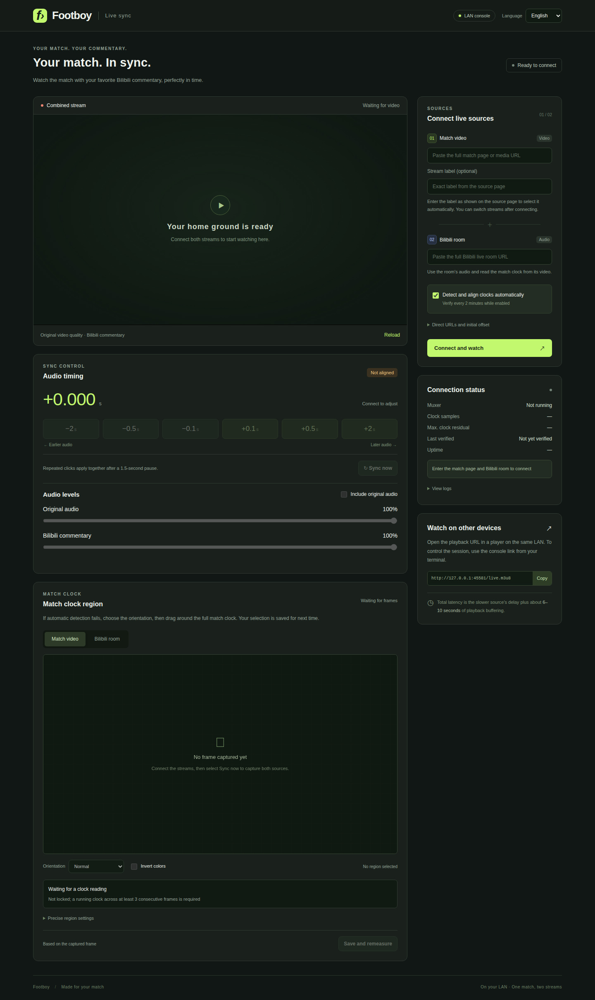
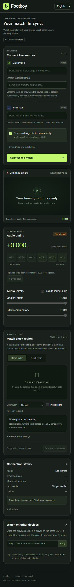
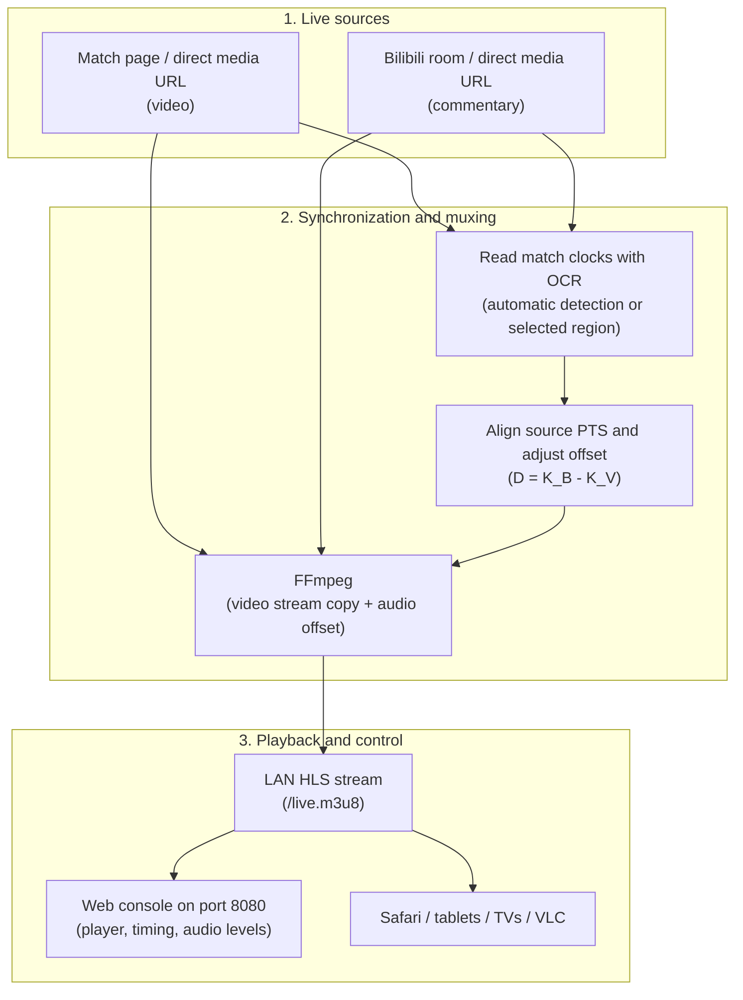

# Footboy

[简体中文](README.md) | **English**

[](https://www.python.org/downloads/)
[](LICENSE)
[](https://github.com/M1zore1337/footboy/actions/workflows/ci.yml)
[](https://github.com/astral-sh/ruff)
[](#watching-on-other-devices)

Synchronize football video from a match website with live commentary from Bilibili, then watch the combined HLS stream on your local network.



<details>
<summary>Mobile console (390px)</summary>



</details>

Screenshots show the console before connecting any streams, with English selected.

Footboy grew out of a simple viewing habit: watching a match on one website while listening to a favorite Bilibili commentator. The two streams can be seconds or tens of seconds apart, and manual alignment often drifts. Footboy reads the match clocks with OCR, calculates the difference between the source timelines, and combines the video and audio for phones, tablets, TVs, or desktop players.

Live testing has focused on the match websites and Bilibili rooms used by the author. Compatibility with other sites and platforms varies.

## Features

- **Original video quality:** copy the video stream without re-encoding; convert audio to AAC as needed.
- **Automatic or manual sync:** read both match clocks with OCR, select a clock region interactively, and adjust audio by ±0.1, ±0.5, or ±2 seconds.
- **Manual adjustments take priority:** repeated clicks apply together after a 1.5-second pause. Periodic OCR checks do not overwrite a manual offset.
- **Independent audio levels:** adjust commentary and original match audio separately, or mute either source.
- **Stream switching:** choose a stream by its label on the match page. Footboy validates the replacement before switching.
- **LAN playback:** use Safari, VLC, compatible TV players, or the built-in web player.
- **Chinese and English:** Chinese remains the default. Choose **English** in the console, or run the CLI with `--lang en`.



## Contents

- [Quick start](#quick-start)
- [Choosing a language](#choosing-a-language)
- [External dependencies](#external-dependencies)
- [Connecting and synchronizing](#connecting-and-synchronizing)
- [Watching on other devices](#watching-on-other-devices)
- [Troubleshooting](#troubleshooting)
- [How synchronization works](#how-synchronization-works)
- [Command-line options](#command-line-options)
- [Control API and offline diagnostics](#control-api-and-offline-diagnostics)
- [Testing and validation](#testing-and-validation)
- [Development](#development)
- [License and disclaimer](#license-and-disclaimer)

## Quick start

### 1. Install prerequisites

Footboy requires **Python 3.10+** and **FFmpeg 6.0+**, including `ffprobe`. For automatic OCR synchronization, install **Tesseract** with its English language data (`eng`). If you only need manual timing adjustments, Tesseract is optional.

| Platform | Recommended command | Notes |
| --- | --- | --- |
| macOS | `brew install ffmpeg tesseract` | Uses Homebrew |
| Ubuntu / Debian | `sudo apt update && sudo apt install ffmpeg tesseract-ocr tesseract-ocr-eng` | Check that FFmpeg is 6.0 or newer |
| Windows | `winget install Gyan.FFmpeg UB-Mannheim.TesseractOCR` | Or use Scoop: `scoop install ffmpeg tesseract` |

For portable installations or systems without administrator access, see [External dependencies](#external-dependencies).

### 2. Install Footboy

Run the launcher from the repository checkout. **The first launch sets up the environment automatically:**

```bash
# macOS / Linux
./start.sh

# Optional: set up without starting the server
./setup.sh
```

```powershell
# Windows PowerShell / CMD
.\start.bat

# Optional: set up without starting the server
.\setup.bat
```

The scripts check Python 3.10+, FFmpeg 6.0+ and ffprobe, create a local `.venv`, install Footboy with the Tesseract Python interface and Playwright Chromium, and launch a headless browser to verify the installation. **Install the FFmpeg and Tesseract executables as described above**, or place them in `tools/`. Missing Tesseract does not prevent manual synchronization.

Later launches reuse the environment. Changes to `pyproject.toml`, missing dependencies or a missing Chromium installation trigger setup again. Rerun after an interrupted installation; run the setup script explicitly to reinstall and check the environment. Activation is unnecessary, and source changes take effect on the next launch.

```bash
./start.sh --lang en --host 127.0.0.1 --port 8090
./start.sh --lang en --no-auto-measure    # Manual sync only
./start.sh --lang en --check              # Check FFmpeg / ffprobe and exit
./setup.sh --lang en --with-deps          # Linux: install Chromium system libraries; may request sudo
```

All launch arguments are passed to `footboy`. On Windows, use `.\start.bat` / `.\setup.bat` with the same arguments. To select a Python interpreter, set `FOOTBOY_PYTHON` to its executable path (without arguments); an existing `.venv` is still reused. Setup messages also support `--lang en` and `FOOTBOY_LANG=en`.

The scripts always use the repository root as the working directory, including for `hls_out/`, `state.json` and relative path arguments. The server runs in the current terminal; press `Ctrl+C` to stop it. Initial installation needs internet access to download packages and Chromium; subsequent environment checks work offline.

<details>
<summary>Manual installation</summary>

From a checkout of this repository, create and activate a virtual environment:

```bash
# macOS / Linux
python3 -m venv .venv
source .venv/bin/activate
```

```powershell
# Windows PowerShell
py -3 -m venv .venv
.\.venv\Scripts\Activate.ps1
```

Then install the package and browser:

```bash
python -m pip install --upgrade pip
python -m pip install ".[tesseract]"
python -m playwright install chromium
footboy --lang en --check
footboy --lang en
```

For manual sync only, install the base package with `python -m pip install .` and start with `--no-auto-measure`. On Linux, if Chromium is missing system libraries, use `python -m playwright install --with-deps chromium`.

</details>

The terminal prints a fresh control token and links such as:

```text
Control token for this session: <token>
Console links (share links containing the token only with trusted operators):
  http://127.0.0.1:8080/#token=<token>
  http://192.168.1.100:8080/#token=<token>
HLS playback URLs (no control token required):
  http://127.0.0.1:8080/live.m3u8
  http://192.168.1.100:8080/live.m3u8
```

Open a console link and select **English** at the top right. Press `Ctrl+C` in the terminal to stop Footboy gracefully.

- The default OCR setting, `--ocr auto`, detects an available backend. Python 3.10–3.12 users can also install `python -m pip install ".[rapidocr]"` and select `--ocr rapidocr`.
- Tesseract uses `OMP_THREAD_LIMIT=1` by default to reduce CPU contention when both sources are recognized concurrently. An existing `OMP_THREAD_LIMIT` value is preserved.
- Use `--host 127.0.0.1` to restrict the console to the host computer.
- If PowerShell blocks activation scripts, set `Set-ExecutionPolicy RemoteSigned -Scope CurrentUser`, or run `.\.venv\Scripts\footboy.exe` directly.

## Choosing a language

Chinese is the default for both the console and command-line tools.

| Surface | Switch to English | Persistence |
| --- | --- | --- |
| Documentation | Open this [English README](README.en.md) | The Chinese README remains the main entry point |
| Web console | Choose **English** in the top-right language selector | Saved in browser local storage for this origin; still works for the current page if storage is disabled |
| Main CLI | `footboy --lang en` or `footboy --lang en --help` | For that invocation |
| Direct-stream tool | `footboy-p0 --lang en --help` | For that invocation |
| OCR diagnostics | `python -m footboy.tools.ocr_diagnose --lang en --help` | For that invocation, including diagnostic messages |
| CLI environment | Set `FOOTBOY_LANG=en` | Applies to subsequent CLI invocations in that environment; `--lang` takes precedence |

Use `--lang zh-CN` to explicitly select Chinese. Browser language selection is independent of the CLI language. Switching the console language preserves the session, form values, and unsaved clock-region edits. Multiple browsers can use different languages on the same server.

Stream labels, URLs, and recognized OCR text remain exactly as supplied by the source. For example, enter a Chinese stream label in Chinese if that is how it appears on the match website.

## External dependencies

Footboy searches for executables in this order:

**Explicit path (`--ffmpeg`, `--ffprobe`, or `--tesseract-command`) → system PATH → `tools/` in the current working directory → `tools/` in the source checkout.**

A portable installation can use this layout:

```text
tools/
├─ ffmpeg/bin/
│  ├─ ffmpeg(.exe)
│  └─ ffprobe(.exe)
└─ tesseract/
   ├─ tesseract(.exe)
   ├─ required shared libraries
   └─ tessdata/eng.traineddata
```

The root `tools/` directory is ignored by Git.

<details>
<summary><b>Manual installation and custom executable paths</b></summary>

On Windows:

1. Download a release essentials ZIP from the Gyan build linked on the [FFmpeg download page](https://ffmpeg.org/download.html). Extract it so `tools/ffmpeg/bin/` contains both `ffmpeg.exe` and `ffprobe.exe`.
2. Install or copy [Tesseract from UB Mannheim](https://tesseract-ocr.github.io/tessdoc/Installation.html) into `tools/tesseract`. Run `.\tools\tesseract\tesseract.exe --list-langs` and confirm that `eng` is listed. If necessary, place [eng.traineddata](https://github.com/tesseract-ocr/tessdata_fast/raw/main/eng.traineddata) in `tools/tesseract/tessdata/`.
3. Run `footboy --lang en --check`.

To build Tesseract on Linux without a system installation, first install the build dependencies described by the upstream project, then run these commands from its source directory:

```bash
./autogen.sh
./configure --prefix="$(pwd)/tools/tesseract"
make -j$(nproc) && make install
```

Place `eng.traineddata` in `tools/tesseract/share/tessdata/` and set `--tesseract-command` to the resulting executable. Paths can also be supplied explicitly:

```bash
footboy --lang en \
  --ffmpeg "/opt/ffmpeg/bin/ffmpeg" \
  --ffprobe "/opt/ffmpeg/bin/ffprobe" \
  --ocr tesseract \
  --tesseract-command "/usr/local/bin/tesseract"
```

</details>

## Connecting and synchronizing

1. **Enter both sources.** Supply the match page URL and the Bilibili live room URL. For a direct m3u8 or FLV URL, enable the corresponding direct-media option under **Direct URLs and initial offset**.
2. **Select Connect and watch.** Footboy opens Chromium on the host computer to discover media requests and capture the required cookies. It also handles streams embedded in iframes.
3. **Align the clocks.** If both streams show the same running match clock clearly, OCR can determine their timeline offset automatically. If detection fails, choose the correct orientation, drag around the complete clock, and select **Save and remeasure**. Single-frame readings are shown separately from the required consecutive-frame validation.
4. **Fine-tune audio timing.** If commentary is ahead of the video, use **+0.1s / +0.5s / +2s** to delay it. If commentary is behind, use **−0.1s / −0.5s / −2s** to advance it. Repeated clicks apply together after a 1.5-second pause.
5. **Adjust audio or change streams.** Control commentary and original match audio independently. Choose another match stream when needed; Footboy validates it before replacing the current input.

After a manual adjustment, periodic OCR checks offer suggestions without replacing your offset. Select **Sync now** or save a new clock region to realign automatically. A stream switch may require a new timeline measurement.

### Access control

- A new random control token is generated at every startup. Control APIs, status requests, and frame snapshots require it.
- Opening a `#token=...` link stores the token in session storage and removes the fragment from the address bar.
- Browser control requests must come from the same origin. The HLS URL, `/live.m3u8`, requires no token so that TVs and external players can use it directly.

## Watching on other devices

Footboy listens on `0.0.0.0:8080` by default. On the same local network, open:

```text
http://<host-LAN-IP>:8080/live.m3u8
```

- **iPhone, iPad, or Mac:** open the playback URL in Safari for native HLS playback, or use the console link printed in the terminal.
- **TVs and desktop players:** choose the network stream or URL option in a compatible Apple TV/Android TV player, VLC, IINA, PotPlayer, or Kodi.
- **Latency:** the combined stream adds approximately **6–10 seconds** of HLS buffering to the slower input's own latency.
- **Cache cleanup:** FFmpeg removes old segments during playback. The server checks for files left by earlier muxer runs every 5 seconds. Unreferenced segments and initialization files are retained for at least 60 seconds and no less than the observed playlist window; files used by the active muxer remain protected. After stopping, the final playlist and its referenced files remain available so players can finish. The next fresh connection clears the old cache.

<details>
<summary><b>Allow port 8080 through the host firewall</b></summary>

Windows, from an administrator PowerShell:

```powershell
New-NetFirewallRule -DisplayName "Footboy" -Direction Inbound -LocalPort 8080 -Protocol TCP -Action Allow
```

Ubuntu / Debian with UFW:

```bash
sudo ufw allow 8080/tcp
```

CentOS / RHEL with firewalld:

```bash
sudo firewall-cmd --permanent --add-port=8080/tcp && sudo firewall-cmd --reload
```

On macOS, check **System Settings → Network → Firewall**. Allow Python to receive incoming connections and make sure **Block all incoming connections** is disabled.

</details>

## Troubleshooting

| Problem | Likely cause | What to try |
| --- | --- | --- |
| FFmpeg or ffprobe cannot be found | Missing installation or PATH entry | Install them, or pass `--ffmpeg` / `--ffprobe`; verify with `footboy --lang en --check` |
| Tesseract or its model is missing | OCR engine or English language data is absent | Install Tesseract with `eng.traineddata`, use `--ocr rapidocr` on a supported Python version, or start with `--no-auto-measure` |
| A browser opens when connecting | The source requires dynamic media URLs and cookies | This is the stream discovery browser; use `--headless-sniff` on a server without a desktop, where page interaction is unavailable |
| OCR stays “Not aligned” | The clock is obscured, stopped, or difficult to read | Confirm both streams show the same running match clock; select the full clock region, or align manually |
| HEVC does not play on a TV or browser | Decoder support varies | Choose an H.264 stream, or use a player with suitable hardware/software decoding |
| Another device cannot open the console or stream | Host firewall or network isolation | Allow TCP port 8080 and confirm both devices are on the same LAN |

## How synchronization works

The two streams normally have independent presentation timestamps (PTS). For each input:

```text
match clock = source PTS + K
D = K_B - K_V
```

Here, `V` is the match video and `B` is the Bilibili commentary source. FFmpeg applies `-itsoffset D` to the Bilibili input: **positive values delay audio; negative values advance it**. Switching streams can change the source PTS origin, so the baseline must be measured again.

## Command-line options

You can launch an empty console or provide both sources on startup:

```bash
footboy --lang en \
  --video-page "$FOOTBOY_VIDEO_PAGE_URL" \
  --bili-room "$FOOTBOY_BILI_ROOM_URL"
```

| Option | Default | Description |
| --- | --- | --- |
| `--lang {zh-CN,en}` | `zh-CN` | CLI language; overrides `FOOTBOY_LANG` |
| `--video-page URL` | — | Match page URL |
| `--bili-room URL` | — | Bilibili live room URL; provide together with `--video-page` |
| `--video-line "LABEL"` | — | Select the label as shown on the match page; circled numbers are supported |
| `--video-direct` | `false` | Treat the match URL as a direct media URL |
| `--bili-direct` | `false` | Treat the commentary URL as a direct media URL |
| `--video-no-proxy` | `false` | Bypass proxies for the match source |
| `--headless-sniff` | `false` | Discover streams without showing a browser window |
| `--ocr {auto,rapidocr,tesseract}` | `auto` | OCR backend |
| `--tesseract-command PATH` | `tesseract` | Custom Tesseract executable |
| `--no-auto-measure` | `false` | Disable startup and periodic automatic OCR |
| `--offset SECONDS` | — | Initial signed audio offset; positive values delay commentary |
| `--bili-cookies FILE` | — | Netscape-format cookie file |
| `--ffmpeg PATH` / `--ffprobe PATH` | `ffmpeg` / `ffprobe` | Custom executables |
| `--host HOST` / `--port PORT` | `0.0.0.0` / `8080` | Console listen address and port |
| `--state-file FILE` | `state.json` | Persist clock regions, orientation, and offsets |
| `--output-dir DIR` | `hls_out` | HLS output directory |
| `--check` | — | Check FFmpeg and ffprobe, then exit |

For direct-stream validation:

```bash
footboy-p0 --lang en \
  --video-url "http://example.invalid/video.m3u8" \
  --bili-url "http://example.invalid/audio.m3u8" \
  --offset 1.5
```

Replace the example URLs with your actual media sources.

## Control API and offline diagnostics

<details>
<summary><b>Control API</b></summary>

Every `/api/*` request requires `Authorization: Bearer <current-control-token>`. POST requests must use `Content-Type: application/json`. Send `Accept-Language: en` for English messages or `Accept-Language: zh-CN` for Chinese. The default is Chinese; responses include `Content-Language`. Field names, state codes, numeric values, and source data are unchanged by language selection.

| Endpoint | Purpose or request body |
| --- | --- |
| `GET /api/status` | Session state, sources, OCR results, and current offset |
| `POST /api/start` | Required: `video_url`, `bili_url`. Optional: `video_direct`, `bili_direct`, `video_no_proxy`, `video_line_text`, `auto_measure`, `offset_seconds`, `video_headers`, `bili_headers` |
| `POST /api/stop` | Stop the current session |
| `POST /api/offset` | `{"delta_ms":500}` adjusts the current offset in milliseconds |
| `POST /api/remeasure` | Capture new frames and realign with OCR |
| `POST /api/audio` | `{"original_enabled":true,"original_volume":0.25,"commentary_volume":0.8}`; partial updates supported, volumes range from 0 to 1 |
| `POST /api/line` | `{"text":"LABEL"}` switches the match stream |
| `POST /api/resniff` | Open stream discovery again |
| `POST /api/source` | `{"id":1}` confirms a candidate; `{"id":null}` pauses automatic selection |
| `POST /api/roi` | `{"source":"video","roi":[0.1,0.1,0.2,0.1],"flip":"none","inverted":false}` |
| `GET /api/snapshot/{video,bili}.jpg` | Latest captured frame |
| `GET /api/ocr/{video,bili}/{crop,processed}.png?v=VERSION` | Latest OCR crop or preprocessed image |

</details>

<details>
<summary><b>Saved settings and offline OCR diagnostics</b></summary>

`state.json` stores clock regions, orientation, and offsets associated with the sources. It is ignored by Git. Cookies, request headers, and signed media URLs are not persisted in this file.

For offline diagnosis, save decoded frames and their PTS in a `frames.npz` file with `pts` and `frames` arrays. Frames must be `uint8` grayscale or BGR images:

```bash
python -m footboy.tools.ocr_diagnose frames.npz --lang en \
  --start 0 --count 4 --backend tesseract --output ocr-debug-01
# Optionally add: --roi 0.1 0.1 0.2 0.1 --flip none
```

The tool records candidate priorities, crop and preprocessing PNGs, raw OCR text, elapsed times, rejection reasons, and the final result. The output directory must be new. It contains its own `.gitignore`; captured frames and OCR text are intended for local diagnosis.

</details>

## Testing and validation

H.264 video uses MPEG-TS HLS segments; HEVC uses fMP4 HLS. Safari can use native playback; other supported browsers use the bundled `hls.js` player when available.

The test suite covers authentication, PTS calculations, stopped clocks, cookie handling, state recovery, media processing, and browser workflows. Localization checks cover CLI selection, per-client API messages, language persistence, and preserving active edits while switching languages.

Historical validation reports are retained in Chinese:

- [Baseline](docs/validation/validation.md), [v0.1.1](docs/validation/validation-0.1.1.md), [v0.1.2](docs/validation/validation-0.1.2.md), [v0.1.3](docs/validation/validation-0.1.3.md), [v0.1.4](docs/validation/validation-0.1.4.md).
- OCR: [first round](docs/validation/validation-ocr-2026-09-13.md), [second round](docs/validation/validation-ocr-round-2-2026-09-13.md), and [synchronization follow-up](docs/validation/validation-ocr-sync-2026-09-13.md).

These reports distinguish synthetic media tests, offline recordings, and live-source validation. They do not imply that every live platform or device has been tested.

## Development

```bash
python -m pip install -e ".[dev,tesseract]"
git config core.hooksPath .githooks

ruff check src scripts tests
ruff format --check src scripts tests
bash -n setup.sh && bash -n start.sh
node --check src/footboy/serve/static/app.js
node --check src/footboy/serve/static/i18n.js
python -m pytest -ra -m "not slow and not browser"
python -m pytest -ra -m "slow and not browser"
python -m build
```

Install Playwright Chromium, then set `FOOTBOY_BROWSER_TESTS=1` and run `python -m pytest -ra -m browser` to exercise the browser suite.

- Media and OCR tests require FFmpeg, ffprobe, and Tesseract. Tests skip when their dependencies are unavailable. Custom binaries can be selected with `FOOTBOY_FFMPEG`, `FOOTBOY_FFPROBE`, and `FOOTBOY_TESSERACT`.
- Update and stage [CHANGELOG.md](CHANGELOG.md) before every commit, as required by the repository's commit hook.
- Python application messages use English keys in `footboy.i18n.tr` with Chinese translations in `src/footboy/locales/zh-CN.json`. Web copy uses `src/footboy/serve/static/i18n.js`; static elements carry `data-i18n` attributes. Add both language versions when changing user-facing text.
- The project is maintained primarily for personal viewing and technical exploration. Pull requests are not currently accepted; bug reports and suggestions are welcome through Issues.

## License and disclaimer

The project code is licensed under the [MIT License](LICENSE). The bundled `hls.js` component is licensed under Apache-2.0; see the [third-party notices in English](THIRD_PARTY_NOTICES.en.md).

Footboy is an open-source tool for audiovisual synchronization research, image-processing experimentation, and personal learning. The project does not provide sports broadcasts: video and commentary come from URLs supplied by the user. During use, Footboy processes those inputs and generates local HLS playback files.

Users are responsible for obtaining lawful access to input media and complying with the source platforms' terms and applicable copyright laws. Responsibility for disputes arising from use of the tool rests with the user, not the author or contributors.
