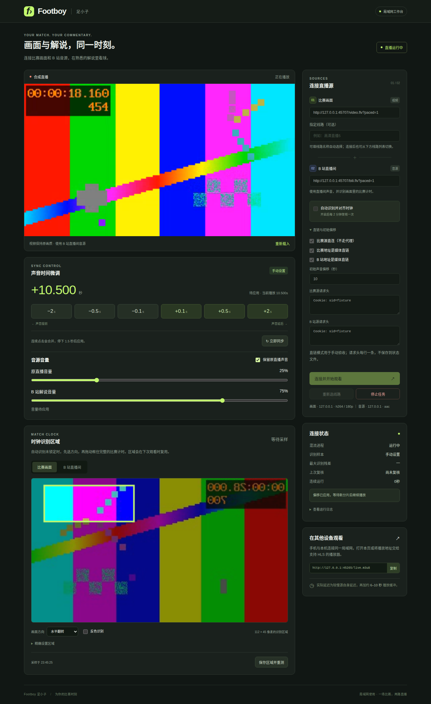
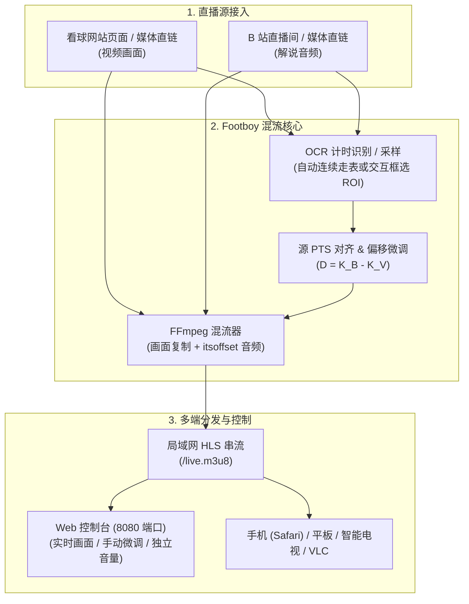

# Footboy（足小子）

[](https://www.python.org/downloads/)
[](LICENSE)
[](https://github.com/M1zore1337/footboy/actions/workflows/ci.yml)
[](https://github.com/astral-sh/ruff)
[](#跨设备与局域网观看)

把看球网站的比赛画面与 B 站直播间的解说音源同步组合，输出局域网 HLS 串流。



> **项目初衷**：平时看球习惯看第三方看球网站的画面，同时听 B 站主播解说；但两路直播往往有数秒甚至几十秒的时延差，手动暂停对齐既麻烦又容易再次漂移。Footboy 通过 OCR 识别两路画面的比赛走表，自动计算时间轴偏差并混流，输出局域网 HLS 串流供手机、电视或平板观看。
>
> *注：目前仅针对作者自己常用的看球网站与 B 站直播间进行了实测，后续会考虑拓展对更多直播网站与平台的支持。*

### 核心特性

- **视频原画复制**：画面始终复制原画质（Stream Copy），音频按需转为 AAC 混流，占用低。
- **自动 / 手动时钟同步**：OCR 读取两路比赛计时自动对齐；支持交互框选 ROI、多方向翻转与六档手动微调（±0.1s / ±0.5s / ±2s）。
- **微调优先与防抖**：微调按钮 1.5 秒连续点击防抖；手动设置优先，过期的定时测量不会覆盖手动偏移。
- **独立音量调节**：两路分别控制音量和静音，可单独听主播解说，也可混入原比赛现场声。
- **线路切换**：比赛源支持按页面文字选择线路，新源探测通过后平滑接替播放。
- **多端同看**：开箱即用输出局域网 HLS，支持手机 Safari、电视盒子与 VLC 等各类播放器。



---

## 目录

- [快速开始](#快速开始)
- [外部依赖准备](#外部依赖准备)
- [连接与观看指南](#连接与观看指南)
- [跨设备与局域网观看](#跨设备与局域网观看)
- [常见问题 (FAQ)](#常见问题-faq)
- [同步原理](#同步原理)
- [命令行参数](#命令行参数)
- [进阶：控制接口与离线诊断](#进阶控制接口与离线诊断)
- [测试与验证状态](#测试与验证状态)
- [开发指南](#开发指南)
- [许可与免责声明](#许可与免责声明)

---

## 快速开始

### 1. 前置依赖（一行命令安装）

Footboy 核心依赖 **Python 3.10+** 与 **FFmpeg 6.0+**。自动 OCR 同步推荐安装 **Tesseract**（含英文语言包 `eng`）。

> 💡 **只想手动调偏？** 如果你只需要在控制台通过按钮手动微调音画对齐（无需 OCR 自动对齐），**只需安装 FFmpeg**，完全不需要安装 Tesseract！

请根据你的操作系统选择最快捷的安装方式：

| 操作系统 | 推荐安装命令 | 说明 |
| :--- | :--- | :--- |
| **macOS** | `brew install ffmpeg tesseract` | 通过 Homebrew 安装 |
| **Ubuntu / Debian** | `sudo apt update && sudo apt install ffmpeg tesseract-ocr tesseract-ocr-eng` | FFmpeg 需 6.0+ |
| **Windows** | `winget install Gyan.FFmpeg UB-Mannheim.TesseractOCR` | 或使用 Scoop：`scoop install ffmpeg tesseract` |

*如需免安装、免管理员权限的绿色便携方案，请参考 [外部依赖准备](#外部依赖准备)。*

---

### 2. 安装与运行 Footboy

```bash
# 1. 创建并激活虚拟环境
# macOS / Linux
python3 -m venv .venv && source .venv/bin/activate
# Windows PowerShell
py -3 -m venv .venv; .\.venv\Scripts\Activate.ps1

# 2. 安装依赖并初始化浏览器组件
python -m pip install --upgrade pip
python -m pip install ".[tesseract]"                  # 纯手动模式可只装基础包: pip install .
python -m playwright install chromium                 # Linux 缺失系统库改用: python -m playwright install --with-deps chromium

# 3. 环境与服务启动
footboy --check                                       # 验证 FFmpeg 与 ffprobe 可用
footboy                                               # 启动服务（默认监听 0.0.0.0:8080）
```

终端将打印带有访问密钥的专属控制链接，例如：
```text
Footboy 控制台已就绪：
本次控制密钥：xxxxxxxxxxxxxxxxxxxxxxxxxxxxxxxx
  http://127.0.0.1:8080/#token=xxxxxxxxxxxxxxxxxxxxxxxxxxxxxxxx
  http://192.168.1.100:8080/#token=xxxxxxxxxxxxxxxxxxxxxxxxxxxxxxxx
```

直接点击链接即可进入 Web 控制台。按 `Ctrl+C` 可优雅停止服务。

> **实用技巧**：
> - **OCR 引擎切换**：默认以 `--ocr auto` 启动，自动检测 Tesseract 或 RapidOCR；Python 3.10–3.12 亦可安装 `pip install ".[rapidocr]"` 并指定 `--ocr rapidocr`。
> - **OCR 并发**：两路画面并行识别时，默认将 Tesseract 的 OpenMP 线程上限设为 1，减少低核数机器上的线程竞争；如需自行调优，可在启动前设置 `OMP_THREAD_LIMIT`，程序会保留该值。
> - **仅本机访问**：若不希望局域网设备访问控制台，可指定 `footboy --host 127.0.0.1`。
> - **Windows 执行权限**：若 PowerShell 提示禁止运行脚本，可使用管理员权限运行 `Set-ExecutionPolicy RemoteSigned -Scope CurrentUser`，或直接执行 `.\.venv\Scripts\footboy.exe`。

---

## 外部依赖准备

Footboy 采用多级查找策略定位外部程序：
> **自定义程序路径（`--ffmpeg`/`--tesseract-command`） → 系统 PATH → 当前工作目录下的 tools/ → 项目根目录下的 tools/**

如果你不便通过系统包管理器安装，可以将可执行文件直接放入项目根目录下的 `tools` 目录（已加入 `.gitignore`，不会随 Git 提交）：

```text
tools/
├─ ffmpeg/bin/
│  ├─ ffmpeg(.exe)
│  └─ ffprobe(.exe)
└─ tesseract/
   ├─ tesseract(.exe)
   ├─ (配套动态库)
   └─ tessdata/eng.traineddata
```

<details>
<summary><b>点击展开：手动下载与便携放置步骤（Windows / Linux 源码编译）</b></summary>

#### Windows 手动配置
1. **FFmpeg**：访问 [FFmpeg 下载页](https://ffmpeg.org/download.html)，下载 Gyan 的 release essentials ZIP，解压至 `tools/ffmpeg`，确保 `tools/ffmpeg/bin/` 下存在 `ffmpeg.exe` 与 `ffprobe.exe`。
2. **Tesseract**：从 [UB Mannheim 安装包](https://tesseract-ocr.github.io/tessdoc/Installation.html) 下载，安装或复制文件至 `tools/tesseract`。运行 `.\tools\tesseract\tesseract.exe --list-langs` 确认包含 `eng`。若缺失，下载 [eng.traineddata](https://github.com/tesseract-ocr/tessdata_fast/raw/main/eng.traineddata) 放入 `tools/tesseract/tessdata/`。
3. 运行 `footboy --check` 验证环境。

#### Linux 源码编译 Tesseract（无 root 权限或旧系统）
按官方说明准备构建依赖后，在 Tesseract 源码目录执行：
```bash
./autogen.sh
./configure --prefix="$(pwd)/tools/tesseract"
make -j$(nproc) && make install
```
将 `eng.traineddata` 放入 `tools/tesseract/share/tessdata/`，启动时指定 `--tesseract-command tools/tesseract/bin/tesseract`。

#### 显式指定外部程序路径
若已在其他目录安装，可直接通过启动参数指定：
```bash
footboy \
  --ffmpeg "/opt/ffmpeg/bin/ffmpeg" \
  --ffprobe "/opt/ffmpeg/bin/ffprobe" \
  --ocr tesseract \
  --tesseract-command "/usr/local/bin/tesseract"
```
</details>

---

## 连接与观看指南

### 核心操作流程

```
[输入比赛页与B站地址] ➔ [点击连接 (弹出嗅探窗口)] ➔ [OCR自动对齐或框选ROI] ➔ [局域网同看 / 独立音量微调]
```

1. **输入直播地址**：在 Web 控制台输入比赛页面 URL 和 B 站直播间 URL（若是 m3u8/flv 媒体直链，请勾选“媒体直链”）。
2. **嗅探连接**：点击「连接」。运行 Footboy 的主机将自动弹出 Chromium 窗口进行流媒体与鉴权 Cookie 捕获（支持 iframe 线路智能嗅探）。
3. **时钟对齐**：
   - **自动对齐**：若两路画面均有清晰的同场比赛走表，Footboy 将在几秒内自动识别并完成 PTS 时钟对齐。
   - **区域框选 (ROI)**：若由于比分牌样式特殊导致未识别，点击画面选择视频方向，框选计时牌区域并保存，系统将立即进行单帧试读与连续验证。
4. **手动微调（调偏直觉口诀）**：
   当画面与解说存在微小偏差时，使用六档微调按钮（`±0.1s` / `±0.5s` / `±2s`）：
   - ⚡ **解说抢跑（声音比画面快）** ➔ 点击 **`+0.1s` / `+0.5s` / `+2s`**（推后声音，增加延迟）。
   - 🐢 **解说滞后（声音比画面慢）** ➔ 点击 **`-0.1s` / `-0.5s` / `-2s`**（提前声音，减少延迟）。
   > 💡 **连续点击防抖**：连续点击微调按钮将在停顿 1.5 秒后合并应用，无需担心频繁重启混流。手动调整后，定时复核仅提供建议，不会覆盖你的手动偏移；点击「立即同步」或重设 ROI 后将重新自动对齐。
5. **音量混音与换线**：
   - 可单独调整 B 站解声音量，或开启/静音原比赛现场声，兼顾现场环境音与主播解说。
   - 比赛卡顿？在控制台直接输入或下拉选择备用线路（如“高清直播⑤”），系统探测成功后自动无缝切换，无需重新打开网页。

### 安全与访问控制

- **动态控制密钥**：每次启动自动生成 32 位安全 Token。所有控制 API、状态查询及采样截图均需验证 Token。
- **URL 片段防泄漏**：首次通过浏览器访问 `#token=...` 后，页面脚本会自动抹去浏览器地址栏中的 Token 片段，防止历史记录泄密。
- **网络边界**：Web 控制台严格校验 Origin 防御 CSRF。HLS 串流地址（`/live.m3u8`）无需 Token，以便各类电视盒子与播放器免鉴权拉流。

---

## 跨设备与局域网观看

Footboy 默认监听 `0.0.0.0:8080`，局域网内的所有设备都可以作为播放终端：

- 📱 **iPhone / iPad / Mac**：在同一局域网 Wi-Fi 下，用 **Safari 浏览器** 打开串流地址 `http://<本机局域网IP>:8080/live.m3u8`，支持苹果原生 HLS 播放；或在 Safari 打开终端打印的控制台链接进行多端操控。
- 📺 **智能电视 / 电视盒子 / PC 播放器**：
  在 Apple TV、Android TV 盒子、VLC、IINA、PotPlayer 或 Kodi 中，选择「打开网络串流 / URL」，输入：
  ```text
  http://<你的电脑局域网IP>:8080/live.m3u8
  ```
  即可在大屏幕上播放混流画面。
- ⏱️ **播放延迟说明**：总延迟由较慢源自身的直播延迟，加上局域网 HLS 分片缓冲（通常约为 **6–10 秒**）组成。
- **分片自动回收**：播放期间由 FFmpeg 滚动删除旧分片，Web 服务每 5 秒检查跨重启残留。旧分片及初始化文件脱离播放列表后，至少保留 60 秒且不少于已观察到的播放列表窗口，再自动回收；当前混流进程正在使用的文件受到保护。停止任务后继续回收未引用文件，保留最后的播放列表及其引用文件供播放器读完；下次连接启动混流时清理旧缓存。

<details>
<summary><b>各系统防火墙端口放行参考（默认 8080 端口）</b></summary>

- **Windows（以管理员身份运行 PowerShell）**：
  ```powershell
  New-NetFirewallRule -DisplayName "Footboy" -Direction Inbound -LocalPort 8080 -Protocol TCP -Action Allow
  ```
- **Linux (Ubuntu / Debian - UFW)**：
  ```bash
  sudo ufw allow 8080/tcp
  ```
- **Linux (CentOS / RHEL - firewalld)**：
  ```bash
  sudo firewall-cmd --permanent --add-port=8080/tcp && sudo firewall-cmd --reload
  ```
- **macOS**：
  进入「系统设置 → 网络 → 防火墙」，确保未开启「阻止所有传入连接」，并在弹出提示时允许 Python 接收外部网络传入连接。
</details>

---

## 常见问题 (FAQ)

| 常见问题 | 产生原因 | 推荐解决办法 |
| :--- | :--- | :--- |
| **找不到 FFmpeg / ffprobe** | 系统未安装或未加入环境变量 | 通过包管理器安装（`brew`/`apt`/`winget`），或在启动时使用 `--ffmpeg` 和 `--ffprobe` 显式指定路径，使用 `footboy --check` 检查 |
| **找不到 Tesseract 或模型** | 缺少 OCR 引擎或缺失英文模型 | 确认安装了 `tesseract` 且含 `eng.traineddata`；亦可改用 `--ocr rapidocr`，或使用 `--no-auto-measure` 转为纯手动调偏 |
| **点击连接后为什么弹出浏览器？** | 目标平台有动态签名防盗链 | Footboy 内置 Playwright 嗅探器捕获真实媒体直链和 Cookie。无桌面服务器可使用 `--headless-sniff`（无头模式，但不支持页面交互） |
| **OCR 一直提示“未对齐”** | 计时牌遮挡、停表或文字特殊 | 1. 确保两路画面均有正在走动的同一比赛计时；<br/>2. 在控制台点击截图并框选 ROI 计时区域；<br/>3. 直接点击微调按钮，手动对齐即刻生效 |
| **电视/播放器无法播放 HEVC** | 客户端硬件解码限制 | 控制台中优先切换为 H.264 线路，或在播放器（如 VLC/Kodi）中启用软件解码 |
| **其他设备无法访问控制台或流** | 主机防火墙拦截入站连接 | 检查主机防火墙设置，放行 8080 端口；确认手机/电视与主机处于同一 Wi-Fi 局域网 |

---

## 同步原理

### 源时间轴对齐数学模型

在直播流中，两路源的起始时间戳（PTS）通常完全独立。设某一物理时刻两路画面的比赛计时与源 PTS 关系为：

```text
比赛时钟 = 源 PTS + K
D = K_B - K_V
```

- $V$ 代表比赛画面源，$B$ 代表 B 站解说音源。
- FFmpeg 混流时，在 B 站音频输入上应用 `-itsoffset D`：**正值推后声音，负值提前声音**。
- 换线后，新线路的源 PTS 起点会发生变化，系统将自动重新测量基线。

---

## 命令行参数

```bash
footboy \
  --video-page "$FOOTBOY_VIDEO_PAGE_URL" \
  --bili-room "$FOOTBOY_BILI_ROOM_URL"
```

*（亦可直接运行 `footboy`，所有参数均可在 Web 控制台中动态录入）*

| 常用参数 | 默认值 | 说明 |
| :--- | :--- | :--- |
| `--video-page URL` | - | 比赛直播页面 URL |
| `--bili-room URL` | - | B 站直播间 URL |
| `--video-line "名称"` | - | 按页面文字自动选线（例如：`高清直播⑤`；支持圈号数字） |
| `--video-direct` | `false` | 将比赛地址直接作为媒体直链（m3u8/flv）处理 |
| `--bili-direct` | `false` | 将 B 站地址直接作为媒体直链处理 |
| `--video-no-proxy` | `false` | 比赛流请求直连，绕过系统代理 |
| `--headless-sniff` | `false` | 无头浏览器嗅探（适合无图形界面的 Linux 服务器或 NAS） |
| `--ocr {auto,rapidocr,tesseract}` | `auto` | OCR 引擎选择；`auto` 自动检测已安装的引擎 |
| `--tesseract-command PATH` | `tesseract` | 自定义 Tesseract 可执行文件路径 |
| `--no-auto-measure` | `false` | 禁用 OCR 自动对齐，完全使用手动微调 |
| `--offset 秒数` | - | 初始音频偏移秒数（正值推后 B 站解说） |
| `--bili-cookies FILE` | - | Netscape 格式的 B 站 Cookie 路径 |
| `--ffmpeg PATH` / `--ffprobe PATH` | `ffmpeg` / `ffprobe` | 自定义 FFmpeg / ffprobe 程序路径 |
| `--host HOST` / `--port PORT` | `0.0.0.0` / `8080` | Web 服务监听地址与端口 |
| `--state-file FILE` | `state.json` | 用户配置持久化文件（按域名保存 ROI 和历史偏移） |
| `--output-dir DIR` | `hls_out` | 局域网 HLS 分片存储目录 |
| `--check` | - | 检查本地 FFmpeg 与 ffprobe 环境并直接退出 |

*手工直链极速验证工具：`footboy-p0 --video-url "http://.../v.m3u8" --bili-url "http://.../a.m3u8" --offset 1.5`*

---

## 进阶：控制接口与离线诊断

<details>
<summary><b>展开查看：RESTful 控制接口定义（供二次开发或脚本自动化）</b></summary>

所有 `/api/*` 请求（包含状态、截图）均需在请求头携带 `Authorization: Bearer <本次控制密钥>`。POST 请求必须声明 `Content-Type: application/json`。

| 接口端点 | 方法 | 说明 |
| :--- | :--- | :--- |
| `GET /api/status` | 获取当前播放状态、源元数据、OCR 读取结果及对齐偏移 |
| `POST /api/start` | `video_url`、`bili_url` 必填；可选 `video_direct`、`bili_direct`、`video_no_proxy`、`video_line_text`、`auto_measure`、`offset_seconds`、`video_headers`、`bili_headers` |
| `POST /api/stop` | 停止当前混流与嗅探任务 |
| `POST /api/offset` | `{"delta_ms": 500}` 相对微调当前偏移毫秒数 |
| `POST /api/remeasure` | 强制重新采样画面并执行 OCR 重新对齐 |
| `POST /api/audio` | `{"original_enabled":true,"original_volume":0.25,"commentary_volume":0.8}` 支持部分字段，音量 0–1 |
| `POST /api/line` | `{"text":"线路名称"}` 切换比赛线路 |
| `POST /api/resniff` | 重新调出浏览器窗口重新嗅探选线 |
| `POST /api/source` | `{"id":1}` 选择候选；`{"id":null}` 暂停自动选择 |
| `POST /api/roi` | `{"source":"video","roi":[0.1,0.1,0.2,0.1],"flip":"none","inverted":false}` |
| `GET /api/snapshot/{video,bili}.jpg` | 获取两路直播当前关键帧截图 |
| `GET /api/ocr/{video,bili}/{crop,processed}.png?v=版本` | 获取最新 OCR 裁剪区域图与二值化预处理调试图 |

</details>

<details>
<summary><b>展开查看：本地配置持久化与离线 OCR 诊断工具</b></summary>

- **配置持久化 (`state.json`)**：
  自动保存用户针对不同域名的 ROI 选区、画面翻转配置与最佳偏移值。该文件已加入 `.gitignore`，且**绝不保存**用户 Cookie、请求头或带签名有效期的直链，保证分享项目或配置时的个人隐私安全。
- **离线算法诊断 (`footboy.tools.ocr_diagnose`)**：
  在排查疑难比分牌字体或低分辨率计时时，可将解码后的帧与 PTS 导出为包含 `pts`、`frames` 数组的 `frames.npz`，使用离线诊断工具分析：
  ```bash
  python -m footboy.tools.ocr_diagnose frames.npz --start 0 --count 4 --backend tesseract --output ocr-debug-01
  # 复查指定区域时可追加 --roi 0.1 0.1 0.2 0.1 --flip none
  ```
  `frames` 使用 `uint8` 灰度或 BGR 图像。工具将输出实际尝试的候选优先级、裁剪与预处理 PNG、原始文字、耗时、淘汰原因和最终结果。输出目录须为新目录，会自动加入 `.gitignore`，其中比赛画面和识别文字仅供本地排查。

</details>

---

## 测试与验证状态

- **流媒体封装**：H.264 视频采用 MPEG-TS HLS 分片；HEVC（H.265）视频采用 fMP4 HLS 分片。Safari 原生兼容，现代浏览器优先加载内置的 `hls.js`。
- **自动化测试**：代码库包含 **240+ 项自动化测试**（覆盖 URL 鉴权、PTS 计算、停表保护、Cookie 穿透、状态回滚与浏览器全流程回归）。
- **历史验证记录**：
  - 功能基线：[基线报告](docs/validation/validation.md) \| [v0.1.1](docs/validation/validation-0.1.1.md) \| [v0.1.2](docs/validation/validation-0.1.2.md) \| [v0.1.3](docs/validation/validation-0.1.3.md) \| [v0.1.4](docs/validation/validation-0.1.4.md)
  - OCR 精度调优记录：[第一轮比对](docs/validation/validation-ocr-2026-09-13.md) \| [第二轮比对](docs/validation/validation-ocr-round-2-2026-09-13.md) \| [同步实测](docs/validation/validation-ocr-sync-2026-09-13.md)
- 欢迎社区在各种不同类型的比赛直播源、智能电视盒子上进行实测并反馈 Issue！

---

## 开发指南

```bash
# 安装开发环境依赖
python -m pip install -e ".[dev,tesseract]"
git config core.hooksPath .githooks                  # 启用内置 Git Commit 钩子检查

# 执行质量检查套件
ruff check src tests                                 # 代码静态规范审查
ruff format --check src tests                        # 格式规范审查
node --check src/footboy/serve/static/app.js         # 前端脚本语法校验
python -m pytest -ra -m "not slow"                   # 快速单元测试（秒级回归）
python -m pytest -ra -m "slow and not browser"       # 媒体处理与实际 OCR 测试
python -m build                                      # 打包 Wheel 与源码分发包
```

- 测试依赖实际 FFmpeg / ffprobe / Tesseract；缺少时对应测试跳过。可通过 `FOOTBOY_FFMPEG`、`FOOTBOY_FFPROBE`、`FOOTBOY_TESSERACT` 指定路径。
- 提交规范：每次 Git 提交前须更新并暂存 [CHANGELOG.md](CHANGELOG.md)。
- 项目维护：本项目主要满足个人日常观赛与技术探索需求，暂不接收 Pull Request；如有 Bug 反馈或使用建议，欢迎通过 Issue 交流。

---

## 许可与免责声明

### 开源许可
- 本项目开源代码采用 [MIT License](LICENSE)。
- 内置分发的播放器组件 `hls.js` 遵循 Apache-2.0 协议，详见 [THIRD_PARTY_NOTICES.md](THIRD_PARTY_NOTICES.md)。

### 免责声明 (Disclaimer)
> 1. **Footboy（足小子）** 是一个仅用于音视频同步技术研究、图像处理算法演练与个人学习交流的开源工具。
> 2. 本项目**不提供、不分发、不存储**任何音视频流或版权赛事直播内容，所有视频画面与解说声音均来自用户自行提供的公开网络地址或合法订阅源。
> 3. 用户在使用本工具时，须自行确保对输入媒体内容拥有合法访问权，并严格遵守目标来源平台的使用条款与相关版权法律法规。因使用本工具引起的任何版权纠纷或法律责任，均由使用者自行承担，与本项目作者及贡献者无关。
